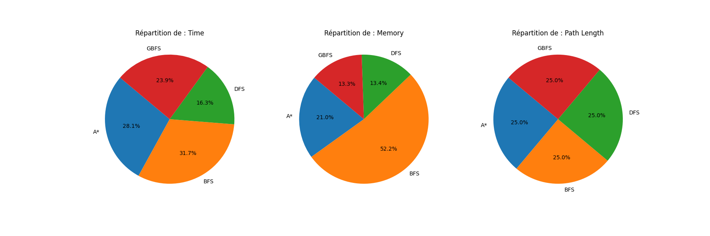
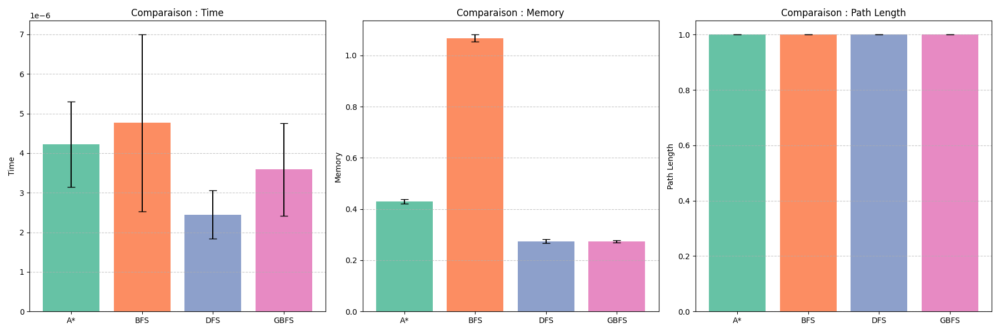
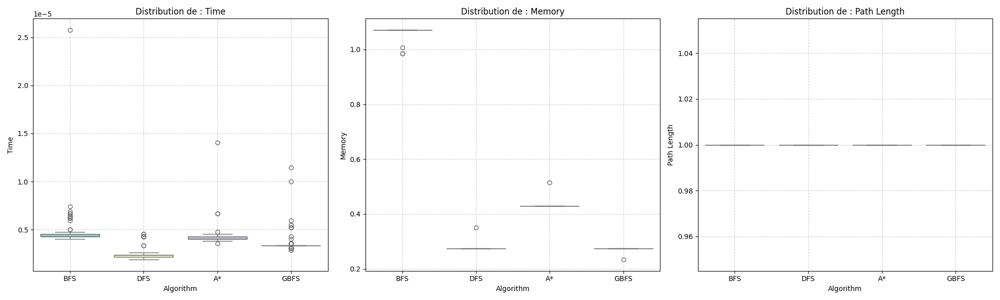
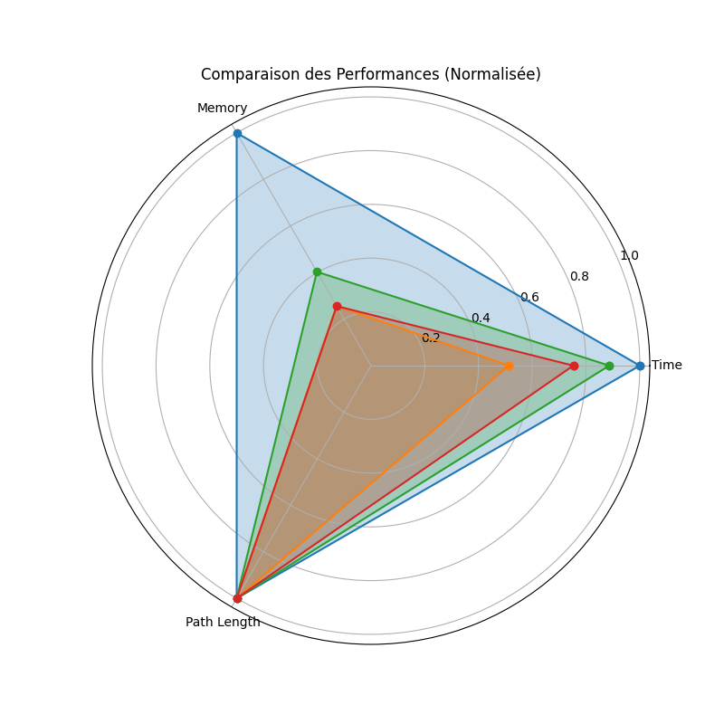

# 📊 Analyse Statistique & Visualisation de Données

Ce projet est une solution complète d'analyse de données conçue pour transformer des mesures brutes en informations visuelles exploitables. Il utilise des bibliothèques avancées de **Data Visualization** pour interpréter les performances et les distributions statistiques de manière professionnelle.

---

## 🛠️ Stack Technique & Tags
`#Python` `#DataAnalysis` `#Matplotlib` `#Seaborn` `#Git` `#DataViz` `#Pandas` `#StatisticalModeling`

---

## 📈 Synthèse Visuelle des Résultats

Voici un aperçu des visualisations générées automatiquement par le script, chacune ciblant un aspect spécifique des données :

### 1. Analyse de Répartition (Pie Charts) 🥧
Visualisation de la composition relative des métriques clés pour comprendre les proportions du dataset.


### 2. Évaluation Comparative (Performance Comparison) 📊
Une comparaison directe et colorée des indicateurs de performance pour une évaluation rapide de l'efficacité.


### 3. Dispersion et Écarts (Boxplots) 📦
Analyse détaillée de la variance et identification immédiate des valeurs aberrantes (outliers) pour chaque catégorie.


### 4. Profil Holistique (Radar Chart) 🕸️
Une vue à 360 degrés combinant plusieurs variables pour évaluer l'équilibre global des résultats du modèle.


---

## ⚙️ Points Forts du Développement
* **Modularité :** Fonctions indépendantes pour chaque type de graphique.
* **Optimisation Graphique :** Exportation automatique en PNG haute résolution avec gestion de la mémoire via `plt.close()`.
* **Rigueur Technique :** Structure de code propre respectant les niveaux d'indentation Python.

---

## 🚀 Installation et Utilisation

Suivez ces étapes pour cloner le projet et générer les visualisations sur votre machine :

1. **Cloner le projet :**
   

   ```bash
   git clone [https://github.com/meryem-bouayadi/Project-AI.git](https://github.com/meryem-bouayadi/Project-AI.git)
